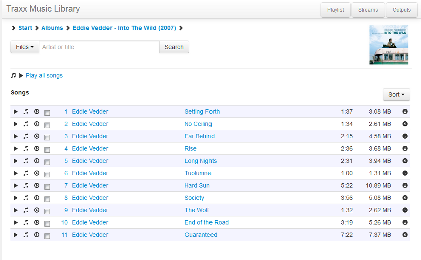

Traxx
=====

Traxx is a collection of applications for managing and accessing a music
collection. It consists of the following components:

* Traxx-web - a web-based client for [MPD](http://mpd.wikia.com/), that uses
  an external database (p.e. in MySQL) for keeping song information.
* Traxx-indexd - a daemon for keeping the music database up to date
* Some tools and libraries to support Traxx-web and traxx-indexd.

All tools are written in Python (developed and tested with 2.7).
At this point, Traxx only supports mp3 files and only looks at ID3 tags.

Database support
----------------

Traxx has only been developed and tested with MySQL. However, since
SQLAlchemy is used for all database access, it should be easy to port to other
databases, like PostgreSQL. To my knowledge, Traxx-web and Traxx-indexd do not
use any database-specific statements, except perhaps for 'func.now()'.

Traxx-web
---------

Traxx-web is a web-based [MPD](http://mpd.wikia.com/)-client.  It was inspired
by [Zina](http://www.pancake.org/zina), but has some different goals and some
different design fundamentals. Traxx lacks many of Zina's features, and some
day it may catch up, but for now, it does the following:

* Let you browse the library; display (sub)directories and songs separately
* Search the database, incrementally display the results (no button click required)
* Manage the MPD playlist: add/remove/move songs, clear/cleanup playlist
* Manage MPD: play, pause, stop, skip
* Display song information (selected attributes from the database)
* Transparently manage MPD's internal music database
* Add external streams from a pre-configured set to the MPD playlist
* Disable/enable MPD outputs
* Responsive design, works great on desktop and tablet browsers, maybe even on smartphones

A screenshot:



Traxx is based on the following principal ideas:

* The external database (for example, in MySQL) is the only source of
  information about the music collection.
* Database maintenance can/should be done with 'traxx-indexd'. The web application
	does not access your music collection directly, except for finding _folder.jpg_ images.
* When a song is added to the playlist, it is transparently added to MPD's
  internal database, by creating a symbolic link to the song in MPD's music directory.
* All text-data is encoded in unicode/UTF-8.

Traxx-web is written in Python (developed and tested with 2.7), using
the [Flask microframework](http://flask.pocoo.org/). At the front, it uses Twitter Bootstrap and
jQuery. The interface makes heavy use of AJAX, but at the same time maintains
the ability to bookmark the content you are viewing and use the back and
forward buttons of your browser to navigate.

The prerequisites for using this software are:
* A working MPD server, not necessarily on the same host (Debian: mpd)
* Optional: a webserver capable of serving WSGI applications
* Flask (&gt;= 0.9, untested with 0.8) and its dependencies (like Werkzeug &amp; Jinja2)
* [Python-mpd v0.3](https://pypi.python.org/pypi/python-mpd/), the MPD client library for Python (Debian: python-mpd)
* [SQLAlchemy](http://www.sqlalchemy.org/) (&gt;= 0.7) (Debian: python-sqlalchemy)

Other third-party components are shipped with the application:
* [Twitter Bootstrap v2.3.0](http://twitter.github.com/bootstrap/)
* [jQuery v1.9.1](http://jquery.com/)
* [jQuery PJAX](https://github.com/defunkt/jquery-pjax) for HTML5 pushState handling
* [Bootstrapx Clickover](https://github.com/lecar-red/bootstrapx-clickover), Bootstrap extension for click managed popovers

Traxx-indexd
------------

Traxx-indexd is a daemon for keeping the music database up to date. It basically
does two things:

- do an initial full recursive scan of the root directory, adding all the mp3 files it
  finds to the database
- after the full scan, it monitors the root directory with _inotify_ for changes and updates
  the database accordingly

It uses several external Python modules:
- sqlalchemy for database access
- mutagen    for reading ID3 tags and other music properties
- daemon     for daemonizing itself into the background
- pyinotify  for monitoring the music library
- argparse   for parsing command line arguments (external to Python < 2.7)
- mp3hash    (see below) for creating ID3-independent hashes of mp3 files

Here's how it's used:

	```
	usage: traxx-indexd [-h] [-D] [-f] [-c] [-m] [-H <hostname>] [-u <username>]
	               [-p <password>] [-n <database>] [-l <file>] [--loglevel <level>]
	               rootdir
	
	Music Indexing Daemon
	
	positional arguments:
	  rootdir                             the directory to index and monitor
	
	optional arguments:
	  -h, --help                          show this help message and exit
	  -D, --daemonize                     run traxx-indexd in the background (default: False)
	  -f, --full                          do a full directory scan at startup (default: False)
	  -c, --clean                         after full scan, clean up unseen files from database (slow). This option does not
	                                      do anything if -f is not specified. (default: False)
	  -m, --md5                           write MD5 checksum to ID3 (default: False)
	  -H <hostname>, --dbhost <hostname>  database server (default: localhost)
	  -u <username>, --dbuser <username>  database user (default: traxx)
	  -p <password>, --dbpass <password>  database password (default: None)
	  -n <database>, --dbname <database>  database name (default: traxx)
	  -l <file>, --logfile <file>         logfile (default: /tmp/traxx-indexd.log)
	  --loglevel <level>                  loglevel, valid levels are <debug|info|warning|error|critical> (default: info)
	
	For security, the database password can also be given by setting it in the DBPASS environment variable. The --dbpass
	option takes precendence over the environment variable.
	```

Getting started
===============

Database initialization
-----------------------

* Create a MySQL database. The default name is 'traxx', but you can name it
  anything you want.
* Add the songtable to the database, from the provided SQL file.

	`mysql -u &lt;user&gt; traxx &lt; traxx-mysql.sql`

* If your mp3 collection is large, perform an initial scan in the foreground.
  This may take a while. Add '-n &lt;dbname&gt;' if your database is not called
  'traxx'.

	`DBPASS=&lt;yourpassword&gt; traxx-indexd --full -u &lt;user&gt; &lt;/path/to/musicdir&gt;`

* Now start `traxx-indexd` in the background to monitor you music collection and keep
  the database up to date.

	`DBPASS=&lt;yourpassword&gt; traxx-indexd --daemonize -u &lt;user&gt; &lt;/path/to/musicdir&gt;`

Try adding files to your collection, moving files around or editing ID3 tags,
and see your changes updated in your database within seconds.

If somehow, after some time, changes to your music library have not been processed
by traxx-indexd, you may want to re-run the full scan.

* To do a quick rescan, only adding newly found files and updating changed
  files before going back to monitoring your collection, combine the options
  above:

	`DBPASS=&lt;yourpassword&gt; traxx-indexd --full --daemonize -u &lt;user&gt; &lt;/path/to/musicdir&gt;`

* To do a full scan + cleanup, which removes files from the database that are
  no longer found in your collection, run traxx-indexd with the '--clean' option:

	`DBPASS=&lt;yourpassword&gt; traxx-indexd --full --clean --daemonize -u &lt;user&gt; &lt;/path/to/musicdir&gt;`

It must be noted, that using '--clean' makes the initial full scan much slower.
Without '--clean', files that have not been changed (based on file modification
time), are just skipped, without any database access being necessary. With
'--clean', all handled files will have their 'lastseen' value updated in the
database, which takes some time. At the end of the scan, the value for
'lastseen' is used to identify and delete all files that were not encountered
during the scan.


Traxx-web installation
----------------------

* Install the prerequisites in a <i>virtualenv</i>

	```bash
	apt-get install python-virtualenv python-dev libmysqlclient-dev
	cd ~/www
	virtualenv venv
	cd venv
	source bin/activate
	pip install sqlalchemy mysql-python mutagen daemon pyinotify
	pip install flask python-mpd2
	git clone https://github.com/tinuzz/traxx.git
	```

* Edit `traxx/web/traxx/traxx.conf`
* Start the server locally:

	`python traxx/web/traxx/__init__.py`

Support-tools and libraries
===========================

mp3hash.py
----------

A small Python program / module for calculating a MD5 hash of an mp3 file.
This hash can be used to identify a file by its musical content, i.e. any
present ID3 tags will not influence the hash. This way, the hash can be
used to detect duplicate songs, even when their tags are different.
The calculated hash can optionally be stored inside the mp3 as a TXXX tag.

	```
	usage: mp3hash.py [-h] [-s] filename

	mp3hash - calculate a hash of an mp3, excluding any ID3 tags, optionally
	storing the hash in an ID3 tag

	positional arguments:
		filename     the file to calculate a hash for

	optional arguments:
		-h, --help   show this help message and exit
		-s, --store  store the calculted hash in the ID3 tag (default: False)
	```

It can also be used as a module from another python program:

	```python
	import mp3hash
	h = mp3hash.mp3hash ()
	md5 = h.mp3hash (filename)[0]
	```

Known limitation: it cannot create a new ID3 tag, so saving the MD5 hash
to a file that doesn't already have a tag will fail.

mp3hash_all
-----------

Mp3hash_all uses mp3hash.py to recursively tag all mp3s in a directory tree.

	```
	usage: mp3hash_all [-h] directory

	mp3hash_all - recursively traverse a directory, hashing all found mp3s and
	store the hash in the ID3 tag of the file

	positional arguments:
		directory   the directory to scan for mp3s

	optional arguments:
		-h, --help  show this help message and exit
	```

License
-------

All software in this project is licensed under the Apache License, version 2.0.
A copy of the license can be found in the 'COPYING' file and on the web [1].

* [1] <http://www.apache.org/licenses/LICENSE-2.0>

